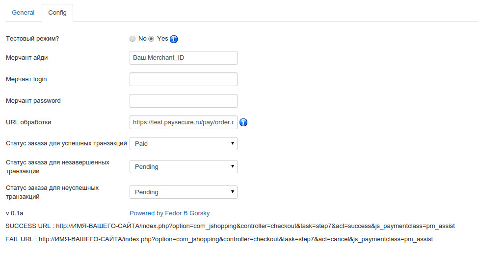

# Модуль платежной системы ASSIST

## Совместимость
joomla 3.4.*
joomshopping 4.11.*

## Установка

Дополнение устанавливается через систему установки JoomShopping, через установку joomla дополнение не установится!

В установщике необходимо выбрать архив 

После установки в опциях->платежные системы

Должен появиться новый способ оплаты

Необходимо открыть его на редактирование и перейти на вкладку config

Ввести параметры, выданные в личном кабинете и сохранить
